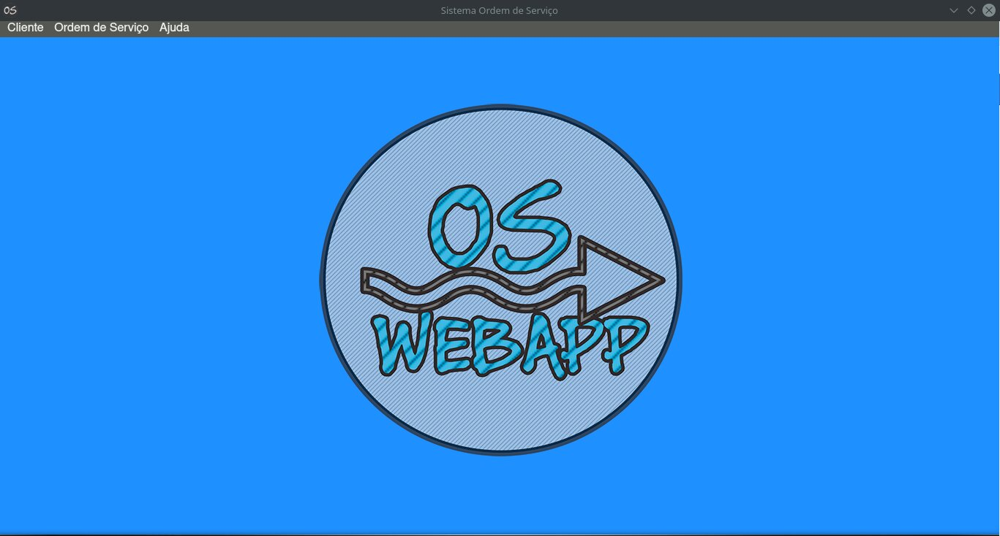
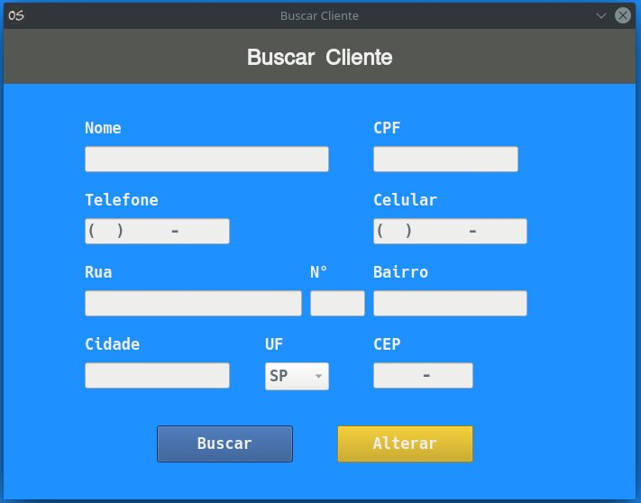
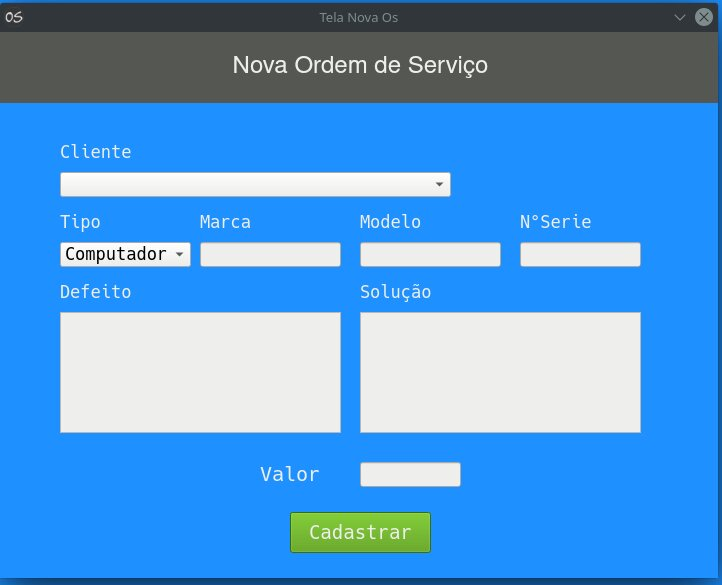
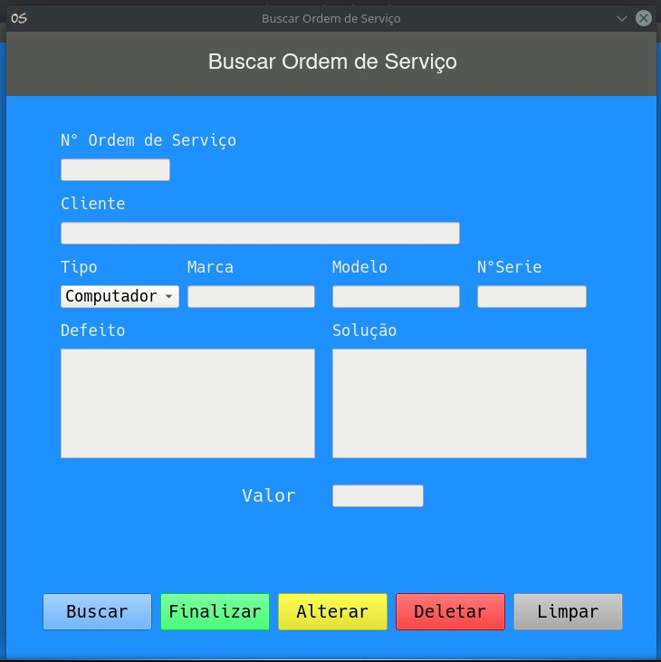

# Sistema de Ordem de Serviço
## Sistema de Ordem de Serviço em Python com PyQT5
<h3>Dependências</h3>
  <ul>PyQt5</ul>
 
<h3>Screenshots</h3>
<h4>Inicio</h4>

<h4>Cadastro de Cliente</h4>

<h4>Buscar Cliente</h4>

<h4>Cadastro de Ordem de Serviço</h4>

  
<h4>Buscar Ordem de Serviço</h4>

<h4>Tela Sobre</h4>

